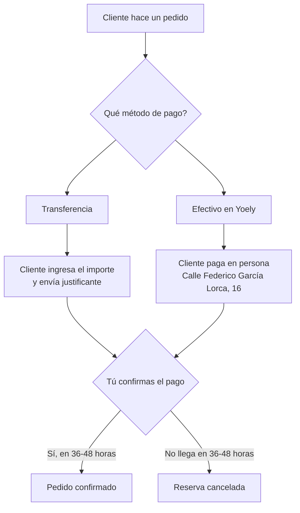
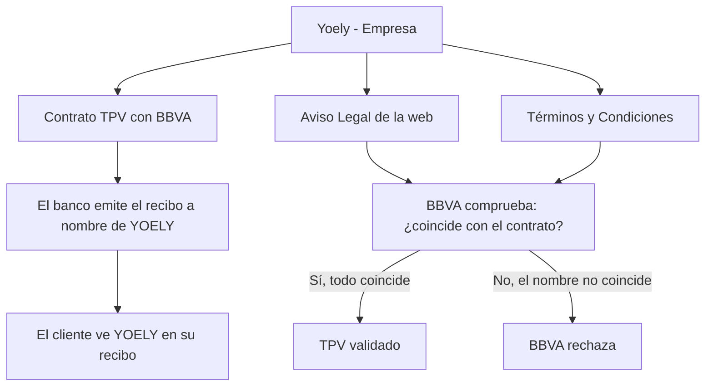

# Informe: Situación del TPV Virtual BBVA/Redsys — Portal Centro Luz

## Resumen Ejecutivo

- El TPV contratado con BBVA no puede activarse porque la web no cumple los requisitos legales de información al cliente (Ley 34/2002 LSSICE).
- Hay que pedir al gestor un documento de Términos y Condiciones de venta y actualizar la web con los datos correctos de la empresa (Yoely).
- El TPV está contratado por Yoely (empresa), no por Centro Luz. Esto afecta a cómo deben redactarse los Términos y Condiciones y al nombre que verá el cliente en su recibo bancario.
- Mientras se resuelve el TPV, se pueden **aceptar pagos por transferencia bancaria o en efectivo en la dirección de Yoely**, con un plazo de reserva de 36 a 48 horas.

---

## Índice de Contenido

- [1. Contexto](#1-contexto)
- [2. Alternativas para empezar a cobrar mientras se resuelve el TPV](#2-alternativas-para-empezar-a-cobrar-mientras-se-resuelve-el-tpv)
- [3. Qué pide BBVA exactamente](#3-qué-pide-bbva-exactamente)
- [4. Qué hay que hacer para desbloquear el TPV](#4-qué-hay-que-hacer-para-desbloquear-el-tpv)
- [5. Atención: el TPV es de Yoely, no de Centro Luz](#5-atención-el-tpv-es-de-yoely-no-de-centro-luz)
- [6. Resumen de acciones](#6-resumen-de-acciones)

---

## 1. Contexto

Yolanda, tras la solicitud a BBVA activar el TPV Virtual en modo real para cobrar con tarjeta en portal.centroluz.net.

BBVA respondió que **no puede validar la web** porque la información legal está incompleta. Sin esa validación, no activan el TPV.

El problema tiene dos partes:

1. **Cumplir la ley** — la web debe mostrar los datos del comercio y las condiciones de venta.
2. **Nombre del titular** — el TPV está contratado por la empresa **Yoely**, pero la web utiliza la marca **Portal Centro Luz** y en el Aviso Legal aparece un nombre de persona distinto.

---

## 2. Alternativas para empezar a cobrar mientras se resuelve el TPV

Mientras el TPV no esté activo, puedes ofrecer dos formas de pago manuales:

| Método | Cómo funciona | Plazo de reserva |
|--------|---------------|------------------|
| **Transferencia bancaria** | El cliente hace un ingreso en cuenta, tu recibes un email de compra en tienda | 36 a 48 horas para que el cliente pague y tu confirmes el pago |
| **Efectivo en Yoely** | El cliente paga en persona en Calle Federico García Lorca, número 16, 03580 Alfaz del Pi, Alicante | 36 a 48 horas para que el cliente pague y tu confirmes el pago |

Ambas opciones requieren que:

- Explicar bien al cliente (comprador) que el pago no es automático
- Definir un plazo máximo de 36 o de 48 horas para que el pago se efectúe
- Si el pago no llega en ese plazo, la reserva se libera

---

## 3. Qué pide BBVA exactamente

BBVA exige que la web incluya los datos del comercio según el **artículo 10 de la Ley 34/2002 LSSICE**, más unos requisitos comerciales adicionales.

| Número | Lo que pide BBVA | Situación actual en la web |
|--------|------------------|----------------------------|
| 1 | Nombre o denominación social (debe coincidir con el contrato) | En el contrato de BBVA el comercio figura como "YOELI". En la web el Aviso Legal muestra "Yolanda González García", que no se corresponde con el nombre de la empresa. **Hay que cambiarlo.** |
| 2 | Inscripción en el Registro Mercantil (solo si aplica) | No aparece en ninguna página de la web |
| 3 | CIF o NIF (debe coincidir con el contrato) | Aparece "25129287Q" en el Aviso Legal. Hay que confirmar con el gestor que es el NIF o CIF correcto de la empresa Yoely |
| 4 | Términos y Condiciones de venta con políticas de cancelación y reembolso | No existe ninguna página de Términos y Condiciones. El Aviso Legal solo habla del uso de la web |
| 5 | Simulación de compra (BBVA la hará cuando la web esté lista) | Pendiente |

---

## 4. Qué hay que hacer para desbloquear el TPV

| Número | Lo que pide BBVA | Acción necesaria |
|--------|------------------|------------------|
| 1 | Nombre o denominación social | **Actualizar el Aviso Legal** para que muestre el nombre de la empresa que figura en el contrato de BBVA: Yoely. Actualmente aparece "Yolanda González García", que no es el nombre correcto. |
| 2 | Registro Mercantil | Consultar con el gestor los datos de inscripción de la empresa Yoely en el Registro Mercantil (o el registro que corresponda) y añadirlos en el Aviso Legal. |
| 3 | CIF o NIF | Confirmar con el gestor que "25129287Q" es el CIF o NIF correcto de Yoely y que coincide con el del contrato de BBVA. Si no, corregirlo. |
| 4 | Términos y Condiciones con cancelación y reembolso | **Es el paso principal.** Hay que pedir al gestor que redacte un documento de Términos y Condiciones de venta adaptado a la actividad. Como el TPV es de Yoely, los Términos y Condiciones deben ir a nombre de Yoely, no de Centro Luz. Una vez redactado, publicarlo en la web. |
| 5 | Simulación de compra | Cuando todo lo anterior esté corregido, responder al correo de BBVA en **PASOPRODUCCIONTPVVIRTUAL@BBVA.COM** para que ellos hagan la simulación. |

---

## 5. Atención: el TPV es de Yoely, no de Centro Luz

### Quién es el titular del TPV

El contrato del TPV con BBVA está formalizado por la empresa **Yoely**. En el email de BBVA, el comercio aparece como **"361868854 - YOELI"** (BBVA escribe "Yoeli" con i, pero el nombre de la empresa es **Yoely**).

Portal Centro Luz y Centro Luz son marcas comerciales. El TPV no puede estar a nombre de una marca, tiene que estar a nombre de la empresa titular. En este caso, la empresa titular es Yoely.

### Qué significa esto para la web y para el cliente

Cada elemento del proceso tiene un nombre distinto, y todos deben coincidir con el contrato de BBVA:

| Elemento | A nombre de | Explicación |
|----------|-------------|-------------|
| Contrato con BBVA | **Yoely** | El TPV está contratado por la empresa Yoely |
| Recibo del banco del cliente | **Yoely** | El cliente que paga con tarjeta verá el nombre de Yoely en su recibo bancario, no "Portal Centro Luz" |
| Aviso Legal de la web | **Debe ir a nombre de Yoely** | Actualmente la web muestra "Yolanda González García". Hay que cambiarlo por el nombre de la empresa Yoely |
| Términos y Condiciones | **Deben ir a nombre de Yoely** | Si se redactan a nombre de Centro Luz, BBVA los rechazará porque no coinciden con el titular del TPV |
| Marca comercial | **Portal Centro Luz** | Es la marca bajo la que operas, pero no es la titular del TPV |

### El riesgo

Si los Términos y Condiciones se redactan a nombre de **Centro Luz** (la marca) o de una persona distinta, pero el TPV es de **Yoely** (la empresa), pasa esto:

- BBVA compara los Términos y Condiciones con el contrato que tiene firmado
- Si el contrato dice "Yoely" y los Términos y Condiciones dicen otro nombre, **los datos no coinciden**
- BBVA deniega la validación otra vez

Además, el cliente que paga con tarjeta verá en su recibo bancario el nombre de **Yoely**, no "Portal Centro Luz". Si no se avisa al cliente, puede pensar que ha pagado a una empresa distinta y reclamar.

### Lo que hay que hacer

- Pedir al gestor que los Términos y Condiciones se redacten a nombre de la empresa **Yoely**, indicando también que opera bajo la marca Portal Centro Luz
- Incluir una nota en la web o en el proceso de compra que aclare que el cobro lo realiza Yoely, para que el cliente no se confunda al ver el nombre en su recibo
- Cambiar el Aviso Legal para que muestre el nombre de la empresa Yoely (y su CIF o NIF), no el de una persona distinta

---

## 6. Resumen de acciones

| Prioridad | Acción | Quién lo hace |
|-----------|--------|---------------|
| 1 | Contactar con el gestor para que redacte los Términos y Condiciones de venta a nombre de Yoely | Yolanda |
| 2 | Actualizar el Aviso Legal con los datos de la empresa Yoely (nombre y CIF o NIF) | Yolanda y el gestor |
| 3 | Obtener los datos de inscripción registral de Yoely (si aplica) y añadirlos al Aviso Legal | Yolanda + PáginaVIVA |
| 4 | Publicar los Términos y Condiciones en la web | PáginaVIVA |
| 5 | Notificar a BBVA en **PASOPRODUCCIONTPVVIRTUAL@BBVA.COM** que la web está actualizada | PáginaVIVA |
| 6 | Mientras tanto, habilitar transferencia bancaria y pago en efectivo como alternativas | Yolanda (aprobación y datos) + PáginaVIVA |

---

*Documento preparado el 15 de junio de 2026 basado en el email de BBVA del 15 de junio de 2026 y la verificación realizada sobre la web y la configuración del plugin Redsys.*
